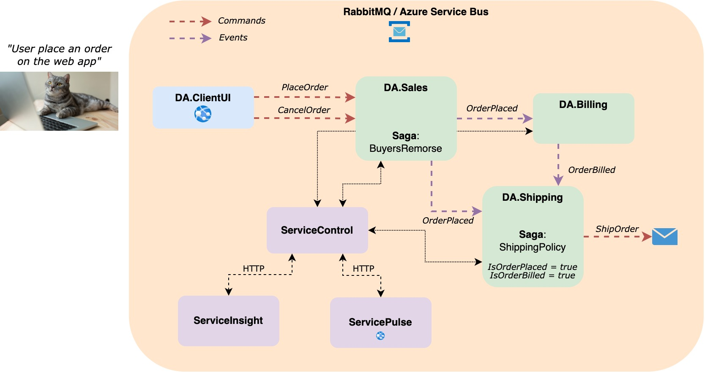

# NServiceBusDemo
## Introduction
The following repo contain a demo project for building a microservices architecture with NServiceBus framework. 
It make use of the base application used by their tutorial with extra features and by using RabbitMQ instead of the learning transport. 
Also, this solution make use of on-premise installation of ServiceControl, ServiceInsight and ServicePulse.

## Architecture
The high level overview of the system is as follow:



## How to run?

1) Run the docker compose file from the infrastructure folder to startup RabbitMQ container

```sh
cd infrastructure
docker-compose up
```

2) Download and install ServiceControl with default settings and select RabbitMQ as a transport. [ServiceControl Installation](https://docs.particular.net/servicecontrol/installation)

3) Download and install ServicePulse with default settings. [ServicePulse Installation](https://docs.particular.net/servicepulse/installation)

4) Dowload and install ServiceInsight with default settings. [ServiceInsight Donwload](https://particular.net/start-serviceinsight-download)

5) Build and run services in Visual Studio
